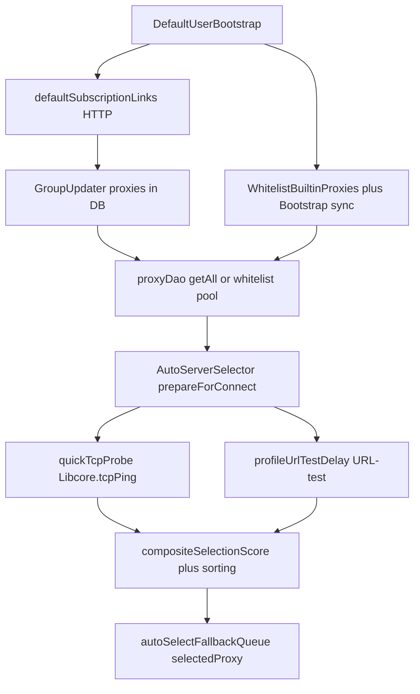

# Промпт-документация: автовыбор серверов (Husi / Dahusim fork)

Этот файл можно целиком копировать во второй Kotlin-проект как контекст для ИИ или разработчиков: указаны **роли модулей**, **поток данных** и **пути к исходникам** в этом репозитории. При переносе замените зависимости от **Libcore**, **buildConfig**, **GuardedProcessPool**, **Room/SagerDatabase** на свои абстракции.

---

## 1. Две независимые «корма» серверов

### A) Подписки (subscription URLs, RAW)

При первом запуске Android создаются группы подписок со ссылками из списка и вызывается обновление (`GroupUpdater.executeUpdate`), чтобы в БД появились прокси из списков.

- Код и **конкретные HTTPS-ссылки**: [`composeApp/src/androidMain/kotlin/fr/husi/bootstrap/DefaultUserBootstrap.kt`](../composeApp/src/androidMain/kotlin/fr/husi/bootstrap/DefaultUserBootstrap.kt)
  - Константы `defaultSubscriptionLinks`, резерв `swordwareVlessReserveLink`, миграция с битого `brokenSwordwareTxtLink`, удаление устаревших `obsoleteQuickSubscriptionLinks`.
  - Для каждой новой подписки: `SubscriptionType.RAW`, `autoUpdate = true`, `autoUpdateDelay = 60` минут, `deduplication = true`.
- После bootstrap вызывается перенастройка фонового обновления подписок: тот же файл → `SubscriptionUpdater.reconfigureUpdater()`.

Фоновое обновление подписок (WorkManager, план интервалов из подписок):

- [`composeApp/src/androidMain/kotlin/fr/husi/bg/SubscriptionUpdater.kt`](../composeApp/src/androidMain/kotlin/fr/husi/bg/SubscriptionUpdater.kt)
- Планирование «когда обновлять»: [`composeApp/src/commonMain/kotlin/fr/husi/bg/SubscriptionAutoUpdate.kt`](../composeApp/src/commonMain/kotlin/fr/husi/bg/SubscriptionAutoUpdate.kt) (`SubscriptionAutoUpdatePlanner`, `dueSubscriptions`, фильтр `autoUpdate`).
- Разбор контента подписки и импорт узлов: [`composeApp/src/commonMain/kotlin/fr/husi/group/GroupUpdater.kt`](../composeApp/src/commonMain/kotlin/fr/husi/group/GroupUpdater.kt).

### B) Встроенные отдельные сервера (Trojan, «whitelist» pool)

Отдельно от подписок задаются **фиксированные Trojan** (общий пароль в коде — это сознательный компромисс для «простого режима»).

- Определения узлов (адрес, порт, SNI, ALPN, флаг «только для whitelist-only pool»): [`composeApp/src/commonMain/kotlin/fr/husi/bootstrap/WhitelistBuiltinProxies.kt`](../composeApp/src/commonMain/kotlin/fr/husi/bootstrap/WhitelistBuiltinProxies.kt)
- Создание группы `GroupType.BASIC`, синхронизация профилей в БД: [`composeApp/src/commonMain/kotlin/fr/husi/bootstrap/WhitelistBuiltinBootstrap.kt`](../composeApp/src/commonMain/kotlin/fr/husi/bootstrap/WhitelistBuiltinBootstrap.kt)
- Вызов из общего bootstrap: [`composeApp/src/androidMain/kotlin/fr/husi/bootstrap/DefaultUserBootstrap.kt`](../composeApp/src/androidMain/kotlin/fr/husi/bootstrap/DefaultUserBootstrap.kt) → `WhitelistBuiltinBootstrap.ensureGroupAndProfiles()`.

Порядок вызова всего bootstrap на Android: `DefaultUserBootstrap.bootstrapAll()` — подписки → per-app defaults → [`ProfileManager.ensureBootstrapRoutingDefaults()`](../composeApp/src/commonMain/kotlin/fr/husi/database/ProfileManager.kt) (правила маршрутизации для RU/BY/KZ и LAN) → whitelist Trojan.

---

## 2. Ядро автовыбора: `AutoServerSelector`

Центральный объект: [`composeApp/src/commonMain/kotlin/fr/husi/database/AutoServerSelector.kt`](../composeApp/src/commonMain/kotlin/fr/husi/database/AutoServerSelector.kt).

**Вход:** `prepareForConnect()`:

1. Читает флаг «на следующий прогон использовать только 4 встроенных whitelist-хелпера» — [`DataStore.simpleModeUseWhitelistBuiltinPoolOnly`](../composeApp/src/commonMain/kotlin/fr/husi/database/DataStore.kt) (строки про whitelist-only; флаг сбрасывается после чтения).
2. Вызывает `WhitelistBuiltinBootstrap.ensureGroupAndProfiles()`.
3. Берёт список прокси: либо все из БД (`proxyDao.getAll()`), либо при whitelist-only — сначала «четвёрка» из [`whitelistPoolProxies()`](../composeApp/src/commonMain/kotlin/fr/husi/bootstrap/WhitelistBuiltinBootstrap.kt), затем остальные.
4. **Быстрый этап (если все в INITIAL или нет AVAILABLE):**
   - Параллельный **TCP ping** через `Libcore.tcpPing`: `quickTcpProbe`.
   - Параллельный **URL-test** по конфигу профиля (`buildConfig(..., forTest = true)`, `client.newInstanceURLTest` с [`DataStore.connectionTestURL`](../composeApp/src/commonMain/kotlin/fr/husi/database/DataStore.kt) и таймаутом) — см. `profileUrlTestDelay`, `urlTestTopCandidates`.
5. **Ранжирование:** композитный скор `compositeSelectionScore` (URL latency доминирует; иначе TCP + синтетический «URL» штраф), плюс статус, ping, трафик, `autoSelectLastKnownGood`, приоритет «priorityFirstIds» (whitelist при ограниченной сети), `userOrder`.
6. Результат: очередь в [`DataStore.autoSelectFallbackQueue`](../composeApp/src/commonMain/kotlin/fr/husi/database/DataStore.kt) / индекс, выбор «лучшего» в `selectedProxy`.

**Отказоустойчивость:** [`tryMoveToFallback`](../composeApp/src/commonMain/kotlin/fr/husi/database/AutoServerSelector.kt) — переход к следующему id в очереди; [`markConnected`](../composeApp/src/commonMain/kotlin/fr/husi/database/AutoServerSelector.kt) — при успешном коннекте сбрасывает очередь и запоминает «last known good».

Точка вызова из UI (simple mode): [`composeApp/src/commonMain/kotlin/fr/husi/ui/simple/SimpleHomeScreen.kt`](../composeApp/src/commonMain/kotlin/fr/husi/ui/simple/SimpleHomeScreen.kt) — выставление `simpleModeUseWhitelistBuiltinPoolOnly` из состояния сети и вызов `AutoServerSelector.prepareForConnect()`.

---

## 3. Связь с автообновлением подписок (не путать с выбором узла)

Автообновление **не** выбирает сервер для подключения — оно только подтягивает списки по HTTP и обновляет БД. Логика интервалов и «due»: [`SubscriptionAutoUpdate.kt`](../composeApp/src/commonMain/kotlin/fr/husi/bg/SubscriptionAutoUpdate.kt). Связка с Android WorkManager: [`SubscriptionUpdater.kt`](../composeApp/src/androidMain/kotlin/fr/husi/bg/SubscriptionUpdater.kt).

---

## 4. Что переносить в другое Kotlin-приложение без «велосипеда»

Минимальный переносимый смысл:

| Слой | Заимствовать идею |
|------|-------------------|
| Источники узлов | Отдельные списки URL подписок + опционально захардкоженные профили (как Trojan в `WhitelistBuiltinProxies`) |
| Импорт | HTTP fetch → парсинг формата (у вас это цепочка `GroupUpdater` / RAW) |
| Выбор перед коннектом | Двухфазный health-check (быстрый TCP + реальный URL-test по туннелю) + единый скор + очередь fallback |
| Ограничение сети | Флаг «кандидаты только из подмножества» (аналог whitelist pool) |

Зависимости от стека этого проекта: `Libcore`, `buildConfig`, `GuardedProcessPool`, Room (`SagerDatabase`) — в новом приложении заменить на свои аналоги (например другой VPN core и хранилище).

---

## 5. Диаграмма потока

---

## 6. Безопасность и юридический контекст

Встроенный пароль Trojan и публичные подписки — **не** секретная модель; в комментарии к [`WhitelistBuiltinProxies.kt`](../composeApp/src/commonMain/kotlin/fr/husi/bootstrap/WhitelistBuiltinProxies.kt) это указано явно. Для продукта с другими требованиями храните учётные данные иначе и пересмотрите источники списков.
